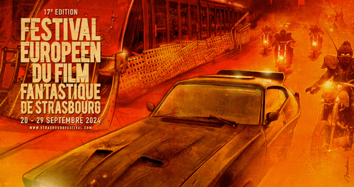
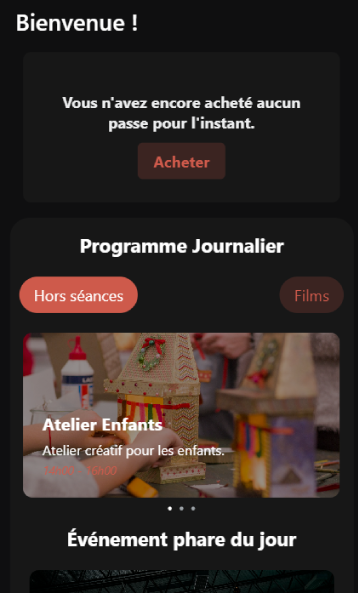
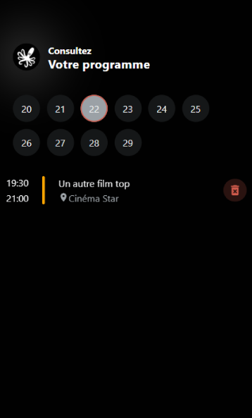
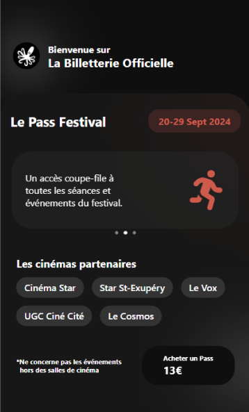

# Festival Européen du Film Fantastique de Strasbourg (FEFFS) - Application Mobile

Bienvenue dans le dépôt de l'application mobile du **Festival Européen du Film Fantastique de Strasbourg** réalisé par des étudiants en BUT MMI !

Cette application est un projet conçue pour offrir une expérience optimale aux festivaliers en leur permettant de gérer tous les aspects de leur participation au festival directement depuis leur smartphone.



---

## 🌟 Points forts

### 🎥 **Accessibilité**

Nous avons accordé une attention particulière à l'accessibilité :

- **Compatibilité avec les lecteurs d'écran** : Chaque élément de l'interface a été conçu pour être navigable et compréhensible par les lecteurs d'écran.
- **Navigation simplifiée** : Des raccourcis de navigation sont disponibles pour faciliter l'accès aux fonctionnalités principales.

> **Notre objectif : rendre l'application accessible à tous, sans exception.**

---

## 🎯 Fonctionnalités

### 👤 **Gestion du compte**
- Inscription et connexion des utilisateurs.
- Gestion complète du profil utilisateur.
- Possibilité d'extraire ses données personnelles (RGPD).

### 🎫 **Pass Festival**
- Achat sécurisé de pass.
- Affichage du QR code pour une validation rapide.
- Gestion des informations associées au pass (nom, prénom, photo, etc.).

### 📅 **Programme & Événements**
- Consultation du programme journalier.
- Filtrage des événements par catégorie (Palmarès, Longs-métrages, Rétrospectives).
- Ajout et suppression d'événements au programme personnel.
- Planning personnalisé avec détection des chevauchements.

### 🎬 **Billetterie**
- Achat de billets pour les événements.
- Informations détaillées sur les cinémas partenaires.
- Tarifs et avantages liés au pass festival.

### 📱 **Fonctionnalités techniques**
- Scanner de QR codes intégré.
- Mode clair/sombre pour un confort visuel optimal.
- Stockage local des données pour un accès hors-ligne.
- Synchronisation en temps réel avec le serveur.

---

## 🛠️ Technologies utilisées

### **Frameworks principaux**
- [Expo](https://expo.dev/) : Plateforme pour les applications React Native.
- [React Native](https://reactnative.dev/) : Framework mobile multi-plateforme.
- [TypeScript](https://www.typescriptlang.org/) : Typage statique pour JavaScript.

### **Navigation**
- [Expo Router](https://docs.expo.dev/router/introduction/) : Navigation avancée.
- [@react-navigation/native](https://reactnavigation.org/) : Navigation native fluide.

### **Stockage**
- [@react-native-async-storage/async-storage](https://react-native-async-storage.github.io/async-storage/) : Gestion du stockage local.

### **UI Components**
- [react-native-qrcode-svg](https://www.npmjs.com/package/react-native-qrcode-svg) : Génération de QR codes.
- [@expo/vector-icons](https://docs.expo.dev/guides/icons/) : Bibliothèque d'icônes.
- [expo-camera](https://docs.expo.dev/versions/latest/sdk/camera/) : Accès caméra.
- [react-native-picker](https://github.com/react-native-picker/picker) : Sélecteur natif.

### **Autres dépendances**
- `expo-image-picker`
- `expo-crypto`
- `expo-blur`
- `react-native-reanimated`
- `react-native-gesture-handler`

---

### Tests d'accessibilité
Nous avons tilisé les outils intégrés aux lecteurs d'écran (comme VoiceOver sur iOS ou TalkBack sur Android) pour vérifier les fonctionnalités d'accessibilité.

---

## 📸 Aperçus

Voici quelques captures d'écran de l'application :





---

## 📚 Informations importantes

### **Projet étudiant non officiel**
Ce projet est une initiative étudiante et n'est pas affilié officiellement au Festival Européen du Film Fantastique de Strasbourg. Il a été développé dans le cadre d'un projet pédagogique pour explorer et mettre en pratique le développement mobile.

### **Créateurs**

- [Eliooooooo](https://github.com/eliooooooo)
- [wav-rover](https://github.com/wav-rover)
- [Tristan-stack](https://github.com/Tristan-stack)
- [Chocoshed](https://github.com/Chocoshed)

---

## 🤝 Contribuer

Les contributions sont les bienvenues ! Pour contribuer :

1. Forkez ce dépôt.
2. Créez une branche pour vos modifications :
   ```bash
   git checkout -b feature/ma-fonctionnalite
   ```
3. Commitez vos changements :
   ```bash
   git commit -m "Ajout d'une nouvelle fonctionnalité"
   ```
4. Poussez la branche :
   ```bash
   git push origin feature/ma-fonctionnalite
   ```
5. Ouvrez une Pull Request.
